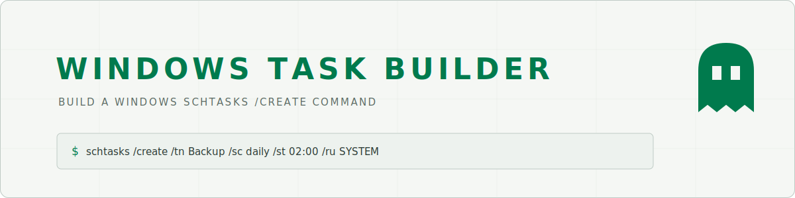

<p align="center">
  <picture>
    <source media="(prefers-color-scheme: dark)" srcset="docs/assets/cover-dark.svg">
    
  </picture>
</p>

<p align="center">
  <a href="https://real-fruit-snacks.github.io/windows-task-builder/"><strong>Live site</strong></a> ·
  <a href="#features">Features</a> ·
  <a href="#run-it">Run it</a> ·
  <a href="#keyboard">Keyboard</a> ·
  <a href="#host-it-yourself">Host it yourself</a> ·
  <a href="#architecture">Architecture</a>
</p>

Fill in the blanks and get a complete schtasks /create command — schedule dropdowns, correct quoting, and a copy button. Plus a searchable Last Run Result code reference for tasks that fail. Styled with the
[Terminal Workbench design system](https://github.com/Real-Fruit-Snacks/terminal-workbench-design-system):
calm graphite surfaces, restrained ANSI accents, monospace manifest labels.

**No network. No dependencies. No build step.** Everything runs in your browser and nothing you enter
ever leaves the page. Open `index.html` from a USB stick and it works.

## Features

- Fill in the fields and get a complete `schtasks /create` command.
- One-click examples (daily, hourly, at-logon, at-startup, once).
- Covers triggers, schedules, run-as, and common options.
- Includes a searchable result-code reference.
- **Both themes, six accents** — dark by default, light by preference or toggle; inputs, scrollbars and focus rings all follow the theme.
- **The ghost** — the family site pet, ported from [worldclock](https://github.com/Real-Fruit-Snacks/worldclock). It drifts, naps, and flees the cursor. Click it to recolor it.
- **Private by construction** — no network requests, no analytics, no external fonts. Everything runs in your browser; nothing you enter ever leaves the page.

## Run it

Open `index.html`. That's it — it works from `file://`, a USB stick, or any static file server.

For a local server:

```
python -m http.server 8000
```

then visit http://localhost:8000.

## Keyboard

Press `?` in the app to bring up this list at any time.

| Key | Action |
|---|---|
| `/` | focus the first input |
| `s` | settings |
| `t` | toggle theme |
| `?` | this help |
| `esc` | close / unfocus |

## Host it yourself

Everything needed to host is in this repository — static files only, no build.

**GitHub Pages:** fork or push this repo, then Settings → Pages → Deploy from branch → `main` / `/ (root)`.
The included `.nojekyll` is required (it stops Jekyll from mangling the files).

**GitLab Pages:** the included [`.gitlab-ci.yml`](.gitlab-ci.yml) publishes the site on every push to the
default branch — no configuration. Works on self-hosted / airgapped GitLab too; the job only copies files.

**Anything else:** copy `index.html`, `css/`, and `js/` to any web root.

**Offline / airgapped:** grab the zip from the [latest release](https://github.com/Real-Fruit-Snacks/windows-task-builder/releases/latest)
— it contains everything above; no network is needed to host or run it.

## Architecture

| File | Responsibility |
|---|---|
| `js/tool.js` | tool logic and UI |
| `js/result-codes.js` | tool logic and UI |
| `js/result-codes-view.js` | tool logic and UI |
| `js/settings.js` | preference store (sole `localStorage` owner), settings panel, theme/accent, keyboard shortcuts, help |
| `js/content.js` | click-to-copy buttons for code examples |
| `js/pet.js` | the ghost |

Plain scripts, one shared `TW` namespace, two window events (`tw:prefs`, `tw:pet`) — no framework, no
modules, view-source friendly.

## Credits

- Design tokens: [terminal-workbench-design-system](https://github.com/Real-Fruit-Snacks/terminal-workbench-design-system) (MIT)
- Pet ghost: ported from [worldclock](https://github.com/Real-Fruit-Snacks/worldclock) (MIT)

## License

[MIT](LICENSE)
